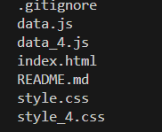

This project includes the task of creating a table with the ability to retrieve data from the server and convert the data to the correct format. The ability to add, delete and edit data is taken into account. For the implementation, we used front-end development technologies HTML, CSS and JavaScript, including work with the DOM, JSON and fetch API.

## Structure

## Link to my project: https://tetiana5buria.github.io/HTTP.-Requests.-Backends./